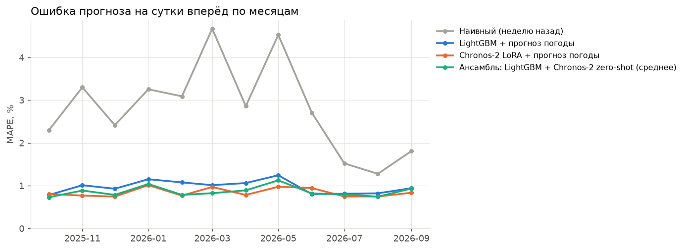
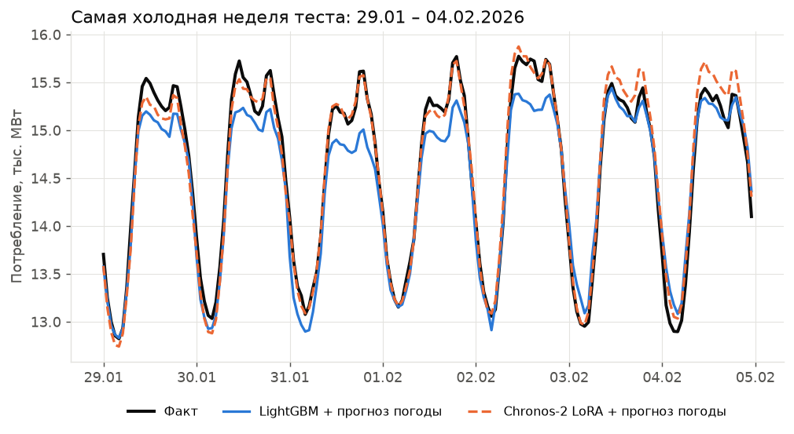
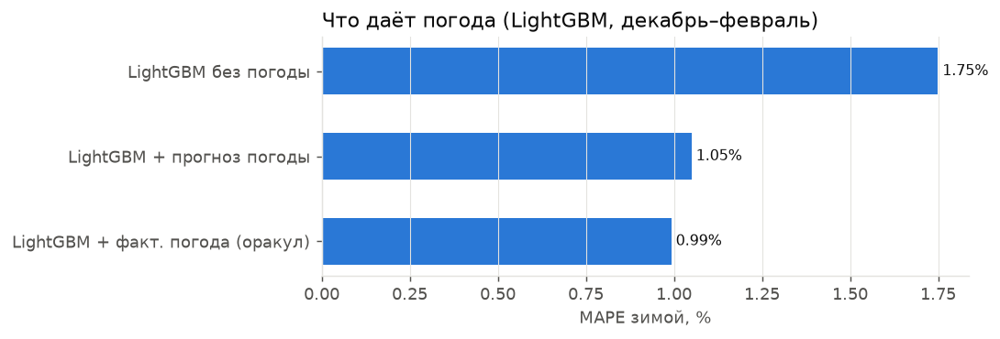

# Прогноз потребления ОЭС Северо-Запада на сутки вперёд — результаты

Тест: 01.10.2025 – 29.09.2026, 364 суток, почасово. Прогноз выпускается накануне в 09:00 МСК; на целевые сутки используется **прогноз** погоды, выпущенный за сутки (кроме строки «оракул»). LightGBM и линейная регрессия переобучаются каждый месяц на всех прошлых данных; Chronos-2 дообучается один раз на данных до начала теста.

## Весь тестовый год

| Модель | MAPE, % | MAE, МВт | RMSE, МВт | MAE в пиковый час, МВт | Смещение, МВт |
|---|---|---|---|---|---|
| Chronos-2 LoRA + прогноз погоды | 0.84 | 96 | 128 | 108 | +9 |
| Chronos-2 полное дообучение + прогноз погоды | 0.85 | 97 | 133 | 110 | -6 |
| Ансамбль: LightGBM + Chronos-2 zero-shot (среднее) | 0.86 | 99 | 130 | 126 | -21 |
| LightGBM + факт. погода (оракул) | 0.95 | 109 | 141 | 126 | -23 |
| Chronos-2 zero-shot + прогноз погоды | 0.97 | 110 | 150 | 141 | -13 |
| LightGBM + прогноз погоды | 0.97 | 112 | 144 | 134 | -30 |
| LightGBM (цель — доля от недельного среднего) + прогноз погоды | 1.06 | 123 | 161 | 137 | -16 |
| Линейная регрессия | 1.20 | 136 | 179 | 155 | -27 |
| Chronos-2 zero-shot, без погоды | 1.27 | 147 | 199 | 182 | -20 |
| LightGBM без погоды | 1.39 | 163 | 220 | 198 | -22 |
| Наивный (неделю назад) | 2.81 | 326 | 426 | 328 | +8 |

## Зима (дек–фев)

| Модель | MAPE, % | MAE, МВт | RMSE, МВт | MAE в пиковый час, МВт | Смещение, МВт |
|---|---|---|---|---|---|
| Chronos-2 полное дообучение + прогноз погоды | 0.83 | 112 | 173 | 122 | +1 |
| Chronos-2 LoRA + прогноз погоды | 0.84 | 114 | 162 | 123 | +22 |
| Ансамбль: LightGBM + Chronos-2 zero-shot (среднее) | 0.87 | 118 | 160 | 147 | -19 |
| Chronos-2 zero-shot + прогноз погоды | 0.90 | 122 | 180 | 147 | -1 |
| LightGBM + факт. погода (оракул) | 0.99 | 133 | 171 | 139 | +5 |
| LightGBM + прогноз погоды | 1.05 | 143 | 180 | 171 | -36 |
| LightGBM (цель — доля от недельного среднего) + прогноз погоды | 1.21 | 164 | 207 | 169 | -4 |
| Линейная регрессия | 1.29 | 172 | 230 | 180 | -32 |
| Chronos-2 zero-shot, без погоды | 1.42 | 193 | 256 | 227 | -7 |
| LightGBM без погоды | 1.75 | 241 | 307 | 303 | -107 |
| Наивный (неделю назад) | 2.91 | 394 | 486 | 399 | -41 |

## Лето (июн–авг)

| Модель | MAPE, % | MAE, МВт | RMSE, МВт | MAE в пиковый час, МВт | Смещение, МВт |
|---|---|---|---|---|---|
| Ансамбль: LightGBM + Chronos-2 zero-shot (среднее) | 0.78 | 76 | 96 | 104 | -19 |
| Chronos-2 LoRA + прогноз погоды | 0.81 | 78 | 99 | 96 | -18 |
| LightGBM + прогноз погоды | 0.81 | 78 | 99 | 98 | -20 |
| LightGBM + факт. погода (оракул) | 0.82 | 80 | 100 | 99 | -21 |
| LightGBM (цель — доля от недельного среднего) + прогноз погоды | 0.87 | 84 | 108 | 101 | -16 |
| Chronos-2 полное дообучение + прогноз погоды | 0.88 | 86 | 108 | 108 | -27 |
| Chronos-2 zero-shot + прогноз погоды | 0.96 | 94 | 121 | 125 | -18 |
| LightGBM без погоды | 0.96 | 94 | 120 | 114 | -10 |
| Chronos-2 zero-shot, без погоды | 0.98 | 96 | 124 | 134 | -25 |
| Линейная регрессия | 1.26 | 121 | 152 | 132 | -37 |
| Наивный (неделю назад) | 1.82 | 176 | 251 | 197 | +23 |

## Морозные дни (t < −10 °C)

| Модель | MAPE, % | MAE, МВт | RMSE, МВт | MAE в пиковый час, МВт | Смещение, МВт |
|---|---|---|---|---|---|
| Chronos-2 LoRA + прогноз погоды | 0.94 | 130 | 194 | 154 | +21 |
| Ансамбль: LightGBM + Chronos-2 zero-shot (среднее) | 0.99 | 138 | 190 | 194 | -43 |
| LightGBM + факт. погода (оракул) | 0.99 | 138 | 180 | 165 | +13 |
| Chronos-2 полное дообучение + прогноз погоды | 1.02 | 141 | 223 | 162 | -14 |
| Chronos-2 zero-shot + прогноз погоды | 1.05 | 146 | 223 | 193 | -33 |
| LightGBM + прогноз погоды | 1.12 | 158 | 201 | 216 | -53 |
| Линейная регрессия | 1.27 | 174 | 248 | 166 | -11 |
| Chronos-2 zero-shot, без погоды | 1.35 | 189 | 253 | 226 | -69 |
| LightGBM (цель — доля от недельного среднего) + прогноз погоды | 1.42 | 199 | 242 | 215 | -9 |
| LightGBM без погоды | 2.06 | 296 | 370 | 437 | -248 |
| Наивный (неделю назад) | 3.01 | 420 | 521 | 438 | -259 |

## Графики

## Важность признаков LightGBM (доля gain, %)

| Признак | % |
|---|---|
| cons_lag48 | 79.2 |
| cons_lag168 | 13.1 |
| cons_lag72 | 2.0 |
| temp_day_max | 0.6 |
| hour | 0.6 |
| cons_lag336 | 0.5 |
| dow | 0.5 |
| day_type | 0.4 |
| temp_day_mean | 0.3 |
| cons_last_known | 0.3 |
| doy_sin | 0.3 |
| temp_delta_vs_lag2 | 0.3 |

## Время работы Chronos-2 (Apple M3, MPS), сек

| Этап | сек |
|---|---|
| chronos_ft_lora_train | 2823 |
| chronos_ft_lora_cov_fcst | 89 |
