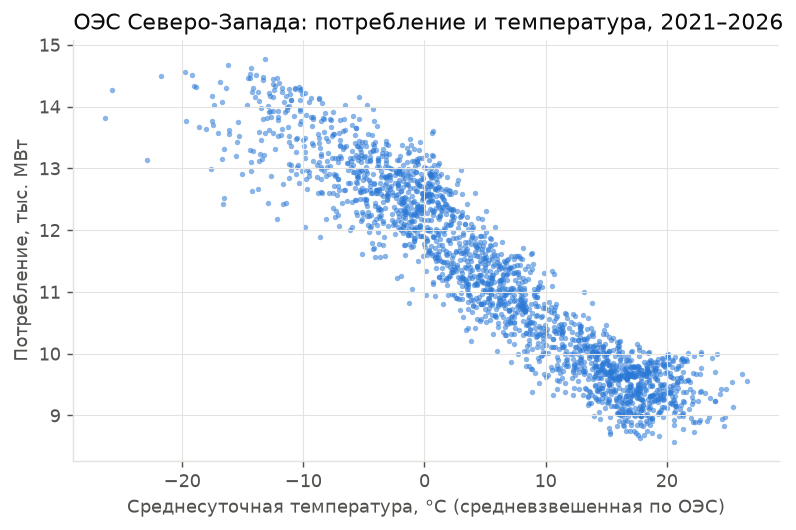
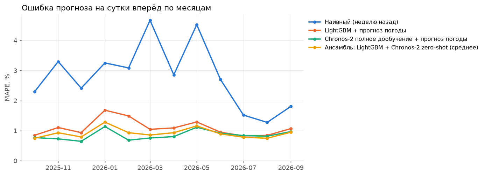
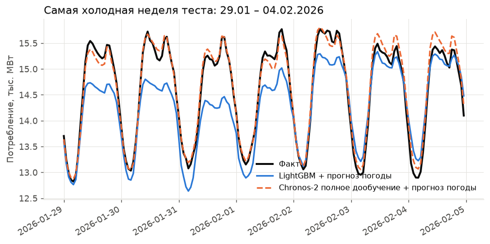
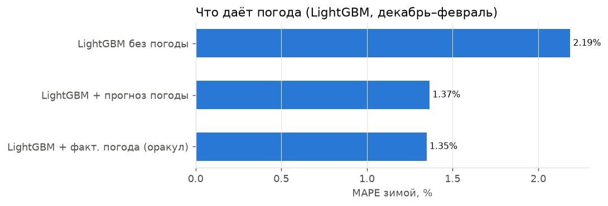

# Прогноз потребления ОЭС Северо-Запада на сутки вперёд — результаты

Тест: 01.10.2025 – 29.09.2026, 364 суток, почасово. Прогноз выпускается накануне в 09:00 МСК; на целевые сутки используется **прогноз** погоды, выпущенный за сутки (кроме строки «оракул»). LightGBM и линейная регрессия переобучаются каждый месяц на всех прошлых данных; Chronos-2 дообучается один раз на данных до начала теста.

## Весь тестовый год

| Модель | MAPE, % | MAE, МВт | RMSE, МВт | MAE в пиковый час, МВт | Смещение, МВт |
|---|---|---|---|---|---|
| Chronos-2 полное дообучение + прогноз погоды | 0.85 | 97 | 133 | 107 | +4 |
| Chronos-2 LoRA + прогноз погоды | 0.87 | 100 | 133 | 116 | -4 |
| Ансамбль: LightGBM + Chronos-2 zero-shot (среднее) | 0.92 | 106 | 142 | 137 | -24 |
| Chronos-2 zero-shot + прогноз погоды | 0.97 | 110 | 150 | 141 | -13 |
| LightGBM + факт. погода (оракул) | 1.08 | 125 | 169 | 154 | -27 |
| LightGBM + прогноз погоды | 1.10 | 128 | 173 | 163 | -35 |
| Линейная регрессия | 1.19 | 134 | 177 | 146 | -14 |
| Chronos-2 zero-shot, без погоды | 1.27 | 147 | 199 | 182 | -20 |
| LightGBM без погоды | 1.57 | 185 | 253 | 217 | -14 |
| Наивный (неделю назад) | 2.81 | 326 | 426 | 328 | +8 |

## Зима (дек–фев)

| Модель | MAPE, % | MAE, МВт | RMSE, МВт | MAE в пиковый час, МВт | Смещение, МВт |
|---|---|---|---|---|---|
| Chronos-2 полное дообучение + прогноз погоды | 0.83 | 112 | 172 | 121 | +1 |
| Chronos-2 LoRA + прогноз погоды | 0.83 | 112 | 160 | 126 | -8 |
| Chronos-2 zero-shot + прогноз погоды | 0.90 | 122 | 180 | 147 | -1 |
| Ансамбль: LightGBM + Chronos-2 zero-shot (среднее) | 1.01 | 137 | 188 | 184 | -33 |
| Линейная регрессия | 1.25 | 167 | 225 | 167 | -18 |
| LightGBM + факт. погода (оракул) | 1.35 | 184 | 244 | 233 | -30 |
| LightGBM + прогноз погоды | 1.37 | 188 | 249 | 264 | -65 |
| Chronos-2 zero-shot, без погоды | 1.42 | 193 | 256 | 227 | -7 |
| LightGBM без погоды | 2.19 | 299 | 378 | 371 | -99 |
| Наивный (неделю назад) | 2.91 | 394 | 486 | 399 | -41 |

## Лето (июн–авг)

| Модель | MAPE, % | MAE, МВт | RMSE, МВт | MAE в пиковый час, МВт | Смещение, МВт |
|---|---|---|---|---|---|
| Ансамбль: LightGBM + Chronos-2 zero-shot (среднее) | 0.81 | 79 | 100 | 112 | -30 |
| Chronos-2 LoRA + прогноз погоды | 0.83 | 81 | 103 | 104 | -24 |
| Chronos-2 полное дообучение + прогноз погоды | 0.86 | 83 | 106 | 100 | -2 |
| LightGBM + прогноз погоды | 0.87 | 85 | 107 | 116 | -42 |
| LightGBM + факт. погода (оракул) | 0.87 | 85 | 107 | 113 | -35 |
| Chronos-2 zero-shot + прогноз погоды | 0.96 | 94 | 121 | 125 | -18 |
| Chronos-2 zero-shot, без погоды | 0.98 | 96 | 124 | 134 | -25 |
| LightGBM без погоды | 1.00 | 97 | 123 | 113 | -12 |
| Линейная регрессия | 1.29 | 123 | 156 | 134 | -33 |
| Наивный (неделю назад) | 1.82 | 176 | 251 | 197 | +23 |

## Морозные дни (t < −10 °C)

| Модель | MAPE, % | MAE, МВт | RMSE, МВт | MAE в пиковый час, МВт | Смещение, МВт |
|---|---|---|---|---|---|
| Chronos-2 LoRA + прогноз погоды | 0.94 | 131 | 192 | 165 | -35 |
| Chronos-2 полное дообучение + прогноз погоды | 1.01 | 140 | 219 | 155 | -5 |
| Chronos-2 zero-shot + прогноз погоды | 1.05 | 146 | 223 | 193 | -33 |
| Линейная регрессия | 1.26 | 172 | 247 | 162 | -9 |
| Ансамбль: LightGBM + Chronos-2 zero-shot (среднее) | 1.28 | 181 | 241 | 284 | -88 |
| Chronos-2 zero-shot, без погоды | 1.35 | 189 | 253 | 226 | -69 |
| LightGBM + факт. погода (оракул) | 1.69 | 238 | 309 | 357 | -93 |
| LightGBM + прогноз погоды | 1.80 | 256 | 324 | 408 | -143 |
| LightGBM без погоды | 2.68 | 379 | 471 | 530 | -283 |
| Наивный (неделю назад) | 3.01 | 420 | 521 | 438 | -259 |

## Графики

## Важность признаков LightGBM (доля gain, %)

| Признак | % |
|---|---|
| cons_lag48 | 79.2 |
| cons_lag168 | 13.7 |
| cons_lag72 | 1.4 |
| hour | 0.6 |
| temp_day_max | 0.6 |
| temp_day_mean | 0.5 |
| day_type | 0.5 |
| dow | 0.5 |
| cons_lag336 | 0.5 |
| doy_sin | 0.3 |
| cons_last_known | 0.3 |
| temp_delta_vs_lag2 | 0.3 |

## Время работы Chronos-2 (Apple M3, MPS), сек

| Этап | сек |
|---|---|
| chronos_ft_full_train | 1052 |
| chronos_ft_full_cov_fcst | 59 |
